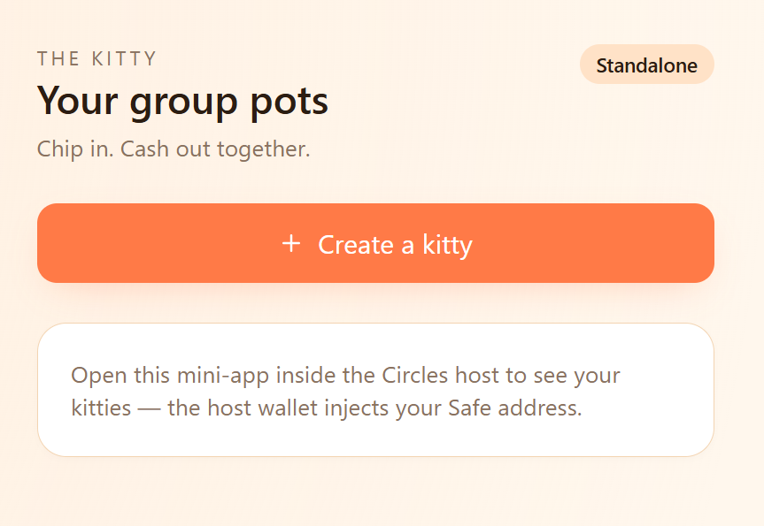
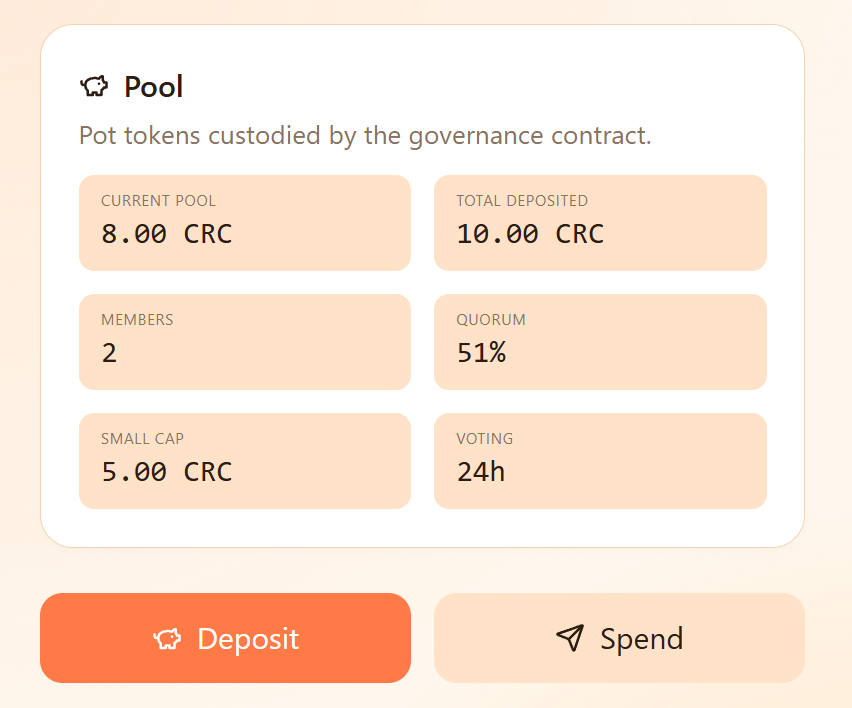
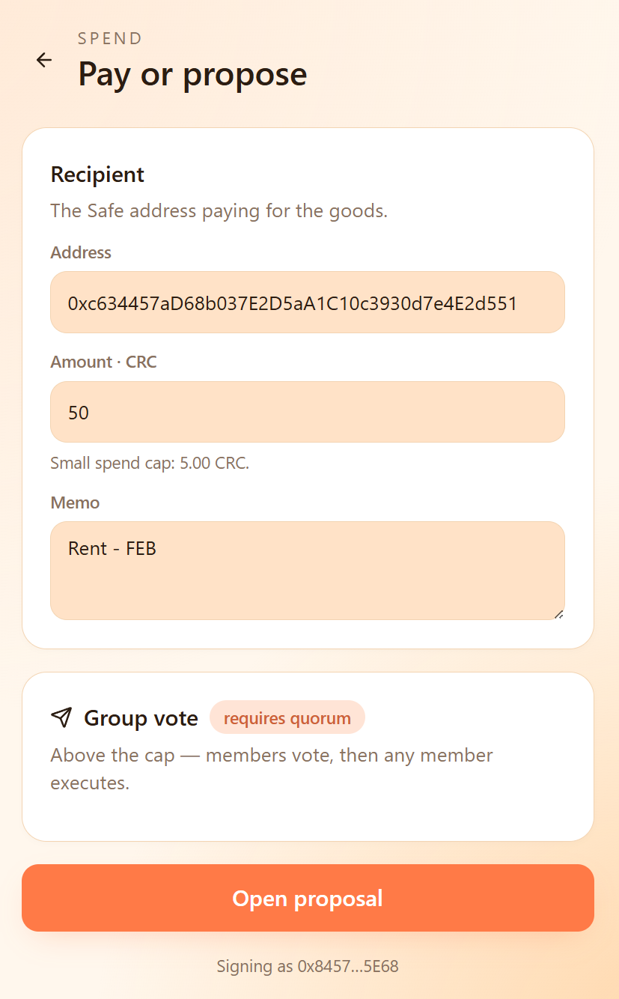
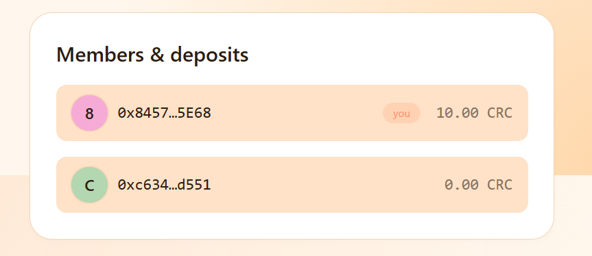
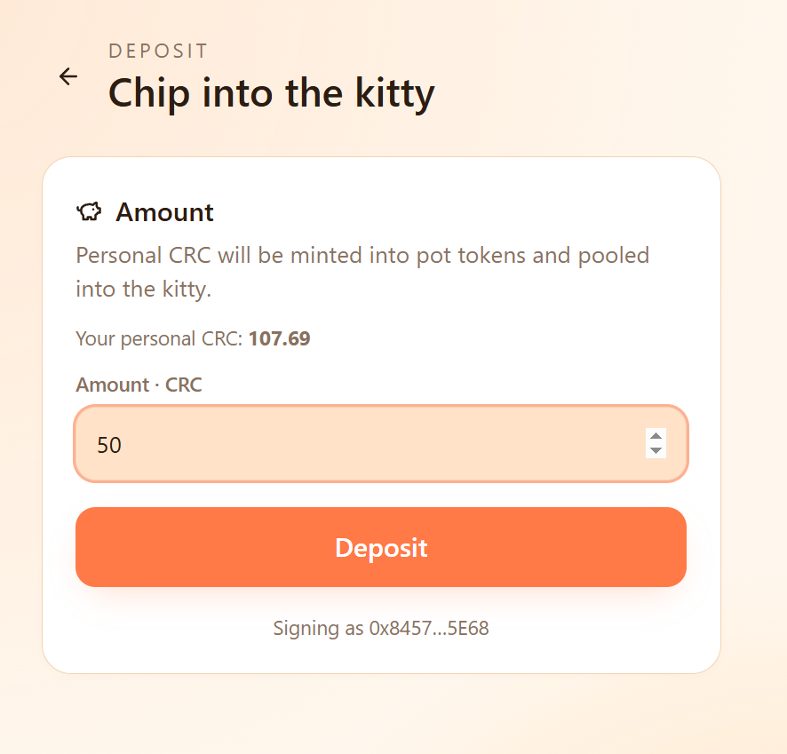

# The Kitty

> **Programmable mutual aid for Circles communities.** A shared on-chain pot with rules in code, on Gnosis Chain.

<table>
  <tr>
    <td width="33%" valign="top" align="center">
      
      <br /><sub><b>Your group pots</b></sub>
    </td>
    <td width="33%" valign="top" align="center">
      
      <br /><sub><b>Pool detail</b></sub>
    </td>
    <td width="33%" valign="top" align="center">
      
      <br /><sub><b>Pay or propose</b></sub>
    </td>
  </tr>
</table>

## What it is

**The Kitty turns a group of Circles humans into a small treasury: every member contributes CRC, the rules (rotation, votes, spend caps) are public and enforced by the smart contract, and the money never sits in a single trésorier's hands.**

A Circles V2 mini-app for two patterns of group money:

- **Rotating tontine (ROSCA)** — every member contributes the same amount each round; one member at a time takes the whole pot. The cycle rotates on-chain, no organizer can run off with the funds. The model behind tandas, sou-sou, hui, and tontines used by hundreds of millions of people globally.
- **Free pot** — a shared treasury with a small-spend cap (any member can pay below it) and a quorum vote for larger expenses. For neighbourhood solidarity funds, collective bills, travel pools, or anything a group budgets together.

In both modes the kitty is a real Circles V2 BaseGroup with a custom governance contract — it lives in the trust graph, not on a single platform.

## How it works

1. **Create a kitty** with 2+ Circles members. Pick *rotating tontine* (set round length + per-member contribution) or *free pot* (set quorum + small-spend cap).
2. **Deposit CRC**: each member commits their share; deposits are tracked on-chain per address.
3. **Pay out**:
   - *Tontine*: when a round opens, the current member calls `claimRound` and receives the full pot. Rotation advances by one.
   - *Free pot*: under the cap → any member pays direct, no vote. Over the cap → propose → approve → execute once quorum is met.
4. **Aligned with Circles demurrage**: idle CRC loses ~7%/yr by design — a kitty keeps the money moving, which is precisely how a Freigeld-style currency is meant to behave.

<table>
  <tr>
    <td width="50%" valign="top" align="center">
      
      <br /><sub><b>Members & deposits</b> — per-member contribution tracker.</sub>
    </td>
    <td width="50%" valign="top" align="center">
      
      <br /><sub><b>Deposit</b> — bundle of groupMint + ERC-1155 transfer in one signature.</sub>
    </td>
  </tr>
</table>

## Why on-chain

- **No trésorier.** No member holds the pool on behalf of the others. The contract is the custodian; the rules of payout are public Solidity, not a Telegram agreement.
- **Anti-rug ROSCA.** The historical failure mode of tontines is the organizer disappearing with the round. With `claimRound` deterministic by member index, the rotation can't be subverted by whoever happens to manage the group chat.
- **Auditable.** Every contribution and every payout is a transaction on Gnosis Chain. The dispute log is the chain itself.
- **Built on Circles humans.** Members are Circles V2 verified humans linked by the trust graph — the same anti-sybil layer that backs CRC itself.

## Architecture

```
User Safe (Circles human)
   │
   │ via @aboutcircles/miniapp-sdk → sendTransactions([...])
   ▼
KittyFactory  ──── createKitty() ─────► BaseGroupFactory → new BaseGroup (Circles V2 group avatar)
                                                            │
                                                            └─── trusts members
                                                            └─── owner transferred to creator
                                  ┌───────────────────────────┘
                                  ▼
                          KittyGovernance
                              (custodian + governance + tontine rotation)
```

- `KittyGovernance.sol` — pool custodian. Runs free-pot governance (`propose / approve / execute / smallSpend`) and, when `tontineMode` is enabled, the rotating `claimRound` payout. The two modes co-exist on the same contract.
- `KittyFactory.sol` — one-tx setup: creates the BaseGroup, trusts members, deploys governance with the chosen mode + parameters, hands BaseGroup ownership back to the creator.

## Deployed (Gnosis Chain, chainId 100)

- KittyFactory: [`0x21539cb2b5a80C88a0D05E631662972589bD010A`](https://gnosisscan.io/address/0x21539cb2b5a80C88a0D05E631662972589bD010A)
- Built on Circles V2 Hub `0xc12C1E50ABB450d6205Ea2C3Fa861b3B834d13e8` + BaseGroupFactory `0xD0B5Bd9962197BEaC4cbA24244ec3587f19Bd06d`.

## Try it

Inside the Circles playground:
```
https://circles.gnosis.io/playground?url=<your-deploy-url>
```

## Stack

- **Frontend** — Vite 6, React 19, Tailwind v4, react-router 7, viem 2.50
- **Wallet** — `@aboutcircles/miniapp-sdk` (host iframe) + Circles profile service for member names & avatars
- **Contracts** — Foundry, Solidity 0.8.24, 61 tests passing. The free-pot core passed a Trail of Bits review; the tontine extension is post-audit and lives on top.
- **Hosting** — Coolify (Docker + Caddy)

## Status

- [x] Phase 0 — sanity check the iframe / SDK / Safe chain
- [x] Phase 1 — `KittyGovernance` + `KittyFactory` deployed
- [x] Phase 2 — create-a-kitty UI (1 tx)
- [x] Phase 3 — deposit, propose, approve, execute, small-spend
- [x] Phase 4 — playful theme, Circles profile enrichment, history tab
- [x] Phase 5 — rotating tontine (`claimRound`, round calendar, current-claimer CTA)
- [ ] V2 — redeem CRC, invite-to-join links, demurrage delta surfaced in UI

## License

AGPL-3.0
