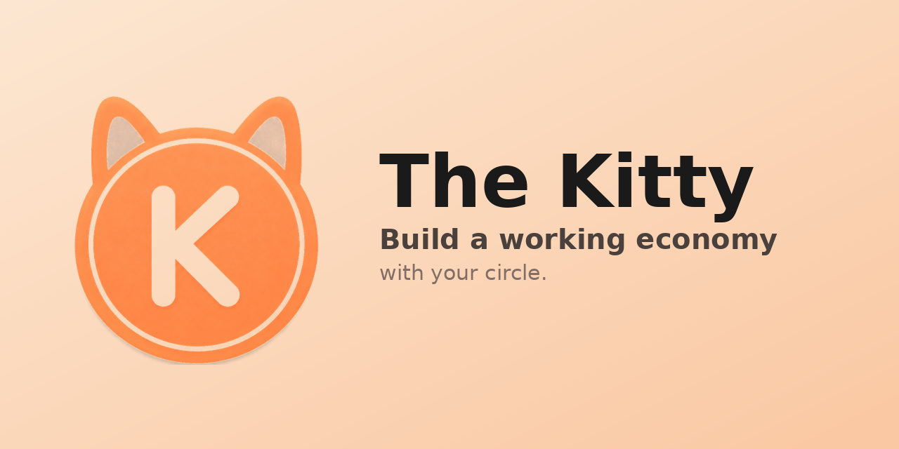

<p align="center">
  
</p>

# The Kitty

> **Build a working economy with people you trust.** Pool CRC in a tontine or group pot, then spend it on services your circle offers — on Circles.

## What it is

**The Kitty turns a Circles trust circle into a working local economy.** Two halves that feed each other: a **services board** where humans publish what they offer in CRC — a haircut, a lesson, a brunch — and **tontines + group pots** where a few people pool CRC and take turns spending it on each other. Every payout lands back inside the trust graph.

The pooling side is the model behind tandas, sou-sou, hui, and tontines — used by hundreds of millions of people globally — rewritten as a Circles V2 mini-app: a real BaseGroup avatar plus a governance contract that enforces the rotation deterministically by member index.

The two pool modes — **rotating tontine** (one member claims the pot each round) and **free pot** (shared treasury with a small-spend cap + quorum vote) — share the same contract, the same primitives, only the payout rule differs.

## How it works

1. **Create a kitty** with 2+ Circles members. Pick *rotating tontine* (set round length + per-member contribution) or *free pot* (set quorum + small-spend cap).
2. **Deposit CRC**: each member commits their share; deposits are tracked on-chain per address.
3. **Pay out**:
   - *Tontine*: when a round opens, the current member calls `claimRound` and receives the full pot. Rotation advances by one.
   - *Free pot*: under the cap → any member pays direct, no vote. Over the cap → propose → approve → execute once quorum is met.
4. **Aligned with Circles demurrage**: idle CRC loses ~7%/yr by design — a kitty keeps the money moving, which is precisely how a Freigeld-style currency is meant to behave.

## Why on-chain

- **No trésorier.** No member holds the pool on behalf of the others. The contract is the custodian; the rules of payout are public Solidity, not a Telegram agreement.
- **Anti-rug ROSCA.** The historical failure mode of tontines is the organizer disappearing with the round. With `claimRound` deterministic by member index, the rotation can't be subverted by whoever happens to manage the group chat.
- **Auditable.** Every contribution and every payout is a transaction on Gnosis Chain. The dispute log is the chain itself.
- **Built on Circles humans.** Members are Circles V2 verified humans linked by the trust graph — the same anti-sybil layer that backs CRC itself.

## Architecture

```
User wallet (Circles human)
   │
   │ via @aboutcircles/miniapp-sdk → sendTransactions([...])
   ▼
KittyFactory  ──── createKitty() ─────► BaseGroupFactory → new BaseGroup (Circles V2 group avatar)
                                                            │
                                                            └─── trusts members
                                                            └─── owner transferred to creator
                                  ┌───────────────────────────┘
                                  ▼
                          KittyGovernance
                              (custodian + governance + tontine rotation)
```

- `KittyGovernance.sol` — pool custodian. Runs free-pot governance (`propose / approve / execute / smallSpend`) and, when `tontineMode` is enabled, the rotating `claimRound` payout. The two modes co-exist on the same contract.
- `KittyFactory.sol` — one-tx setup: creates the BaseGroup, trusts members, deploys governance with the chosen mode + parameters, hands BaseGroup ownership back to the creator.

## Deployed (Gnosis Chain, chainId 100)

- KittyFactory v3: [`0xa6f38d8613F8612Fcfdf89707B479ea4ef554439`](https://gnosisscan.io/address/0xa6f38d8613F8612Fcfdf89707B479ea4ef554439) — adds stake mode + round-zero setup gate + slash mechanism on top of v2's tontine support.
- ServiceRegistry: [`0x26F81d723Ad1648194FAA4b7E235105Fd1212c6c`](https://gnosisscan.io/address/0x26F81d723Ad1648194FAA4b7E235105Fd1212c6c) — singleton catalog of services priced in CRC, with logPayment + 1-5 star ratings. Hub.safeTransferFrom handles the actual CRC transfer between humans.
- KittyFactory v2: [`0x880E213224Ce5B6B8a01A21D4318819c67146533`](https://gnosisscan.io/address/0x880E213224Ce5B6B8a01A21D4318819c67146533) — first tontine release. Kitties created here still work for claim / propose / execute, no stake mode.
- KittyFactory v1: [`0x21539cb2b5a80C88a0D05E631662972589bD010A`](https://gnosisscan.io/address/0x21539cb2b5a80C88a0D05E631662972589bD010A) — free pot only, no tontine.
- Built on Circles V2 Hub `0xc12C1E50ABB450d6205Ea2C3Fa861b3B834d13e8` + BaseGroupFactory `0xD0B5Bd9962197BEaC4cbA24244ec3587f19Bd06d`.

## Try it

Inside the Circles playground:
```
https://circles.gnosis.io/playground?url=<your-deploy-url>
```

## Stack

- **Frontend** — Vite 6, React 19, Tailwind v4, react-router 7, viem 2.50
- **Wallet** — `@aboutcircles/miniapp-sdk` (host iframe) + Circles profile service for member names & avatars
- **Contracts** — Foundry, Solidity 0.8.24, 77 tests passing. The free-pot core passed a Trail of Bits review; the tontine + stake extensions are post-audit and live on top.
- **Hosting** — Coolify (Docker + Caddy)

## License

AGPL-3.0
